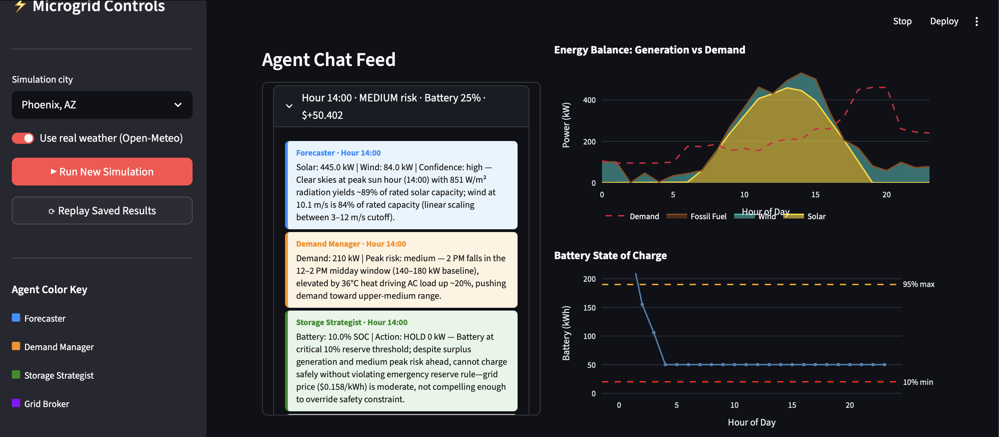

# Microgrid AI Agent Optimizer

A multi-agent AI simulation where four specialized LLM agents collaborate in real-time to manage a community microgrid — balancing solar, wind, battery storage, and fossil fuel backup to maximize profit and minimize emissions.

Built as a data science portfolio project. The dashboard streams agent decisions hour-by-hour alongside live energy and financial charts.

---

## How It Works

Each simulated hour, four Claude-powered agents run in sequence, each reading from and writing to a shared state:

```
START
  ↓
[Forecaster]          Analyzes live weather data → predicts solar & wind output
  ↓
[Demand Manager]      Estimates community load by hour (150-home neighborhood)
  ↓
[Storage Strategist]  Decides whether to charge, discharge, or hold the battery bank
  ↓
[Grid Broker]         Settles conflicts → outputs a unified JSON command
  ↓
END  →  {"buy_grid_kw": 0, "sell_grid_kw": 280, "charge_battery_kw": 120, ...}
```

The agents negotiate each hour: during a sunny midday, the Broker may sell surplus solar to the grid at peak prices. During an evening demand spike, the Storage Strategist discharges the battery while the Broker decides whether to buy grid power or activate the fossil fuel backup generator as a last resort.

---

## Dashboard



**Features:**
- **Live agent chat feed** — colored chat bubbles show each agent's reasoning as the simulation runs
- **Real-time charts** — energy balance, battery state of charge, cumulative net profit, grid price curve
- **Replay mode** — animate a saved simulation at configurable speed (no API calls required)
- **City selector** — choose from 12 cities worldwide; fetches live weather for each location
- **Fossil fuel tracker** — KPI and chart trace shows when backup power activates

---

## Tech Stack

| Layer | Tools |
|---|---|
| Agent orchestration | [LangGraph](https://github.com/langchain-ai/langgraph) `StateGraph` |
| LLM backbone | [Claude Haiku](https://anthropic.com) via `langchain-anthropic` |
| Weather data | [Open-Meteo API](https://open-meteo.com/) (free, no key required) |
| Grid pricing | Simulated TOU curve based on [PG&E rate structure](https://www.pge.com/tariffs/electric.shtml) |
| Dashboard | [Streamlit](https://streamlit.io/) + [Plotly](https://plotly.com/python/) |
| Language | Python 3.10+ |

---

## System Design

### Microgrid Specs (150-home neighborhood)
| Component | Capacity |
|---|---|
| Solar array | 500 kW rated |
| Wind turbines | 100 kW rated |
| Battery bank | 500 kWh (10%–95% SOC operating range) |
| Fossil fuel backup | Gas peaker, $0.35/kWh — last resort only |
| Community peak demand | ~500 kW (6–8 PM) |

### Agent Shared State
All four agents read from and write to a single `MicrogridState` TypedDict passed through the LangGraph pipeline. The `agent_logs` field uses `operator.add` for append-only accumulation across nodes.

---

## Project Structure

```
microgrid-optimizer/
├── agents/
│   ├── forecaster.py          # Solar/wind yield prediction
│   ├── demand_manager.py      # Community load forecasting
│   ├── storage_strategist.py  # Battery charge/discharge decisions
│   └── grid_broker.py         # Final command negotiation
├── core/
│   ├── state.py               # Shared MicrogridState TypedDict
│   ├── graph.py               # LangGraph StateGraph definition
│   ├── simulation.py          # 24-hour simulation loop + streaming generator
│   └── utils.py               # JSON parsing utility
├── data/
│   ├── weather.py             # Open-Meteo API + 12-city coordinate dict
│   └── pricing.py             # Simulated TOU pricing curve
├── dashboard/
│   └── app.py                 # Streamlit dashboard
├── output/                    # Simulation results saved here (gitignored)
├── main.py                    # CLI entry point
└── requirements.txt
```

---

## Setup

**1. Clone and install dependencies**
```bash
git clone https://github.com/JacobBurrill11/microgrid-optimizer.git
cd microgrid-optimizer
pip install -r requirements.txt
```

**2. Add your Anthropic API key**
```bash
cp .env.example .env
# Edit .env and paste your key:  ANTHROPIC_API_KEY=sk-ant-...
```
Get a key at [console.anthropic.com](https://console.anthropic.com). Cost per full simulation run is typically < $0.05 using Claude Haiku.

---

## Running

**Run the dashboard (recommended)**
```bash
streamlit run dashboard/app.py
```
Then click **"Run New Simulation"** in the sidebar to watch agents work in real-time, or **"Replay Saved Results"** to animate a previous run.

**Run a headless simulation**
```bash
python main.py
```
Results are saved to `output/simulation_results.json`.

---

## Data Sources

- **Weather:** [Open-Meteo](https://open-meteo.com/) — free hourly forecast API, no key required
- **Grid pricing:** Simulated time-of-use curve inspired by [PG&E TOU-D-PRIME](https://www.pge.com/tariffs/electric.shtml) rate structure (California)
- **System sizing:** Based on NREL residential solar deployment data (~4 kW/home) and U.S. EIA average household consumption (~10,500 kWh/year)

---

## Available Cities

San Francisco CA · Phoenix AZ · Austin TX · Chicago IL · Miami FL · Denver CO · Seattle WA · New York NY · Los Angeles CA · London UK · Berlin Germany · Sydney Australia

Weather data is fetched live from Open-Meteo for the selected city's coordinates. Try Phoenix vs. Seattle to see how climate dramatically changes the energy mix and financial outcome.
